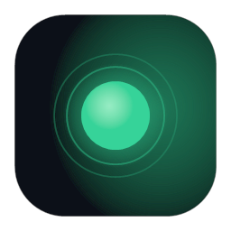
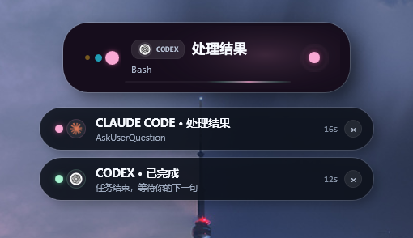
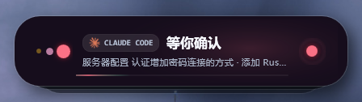

<p align="center">
  
</p>

<h1 align="center">Agent Island</h1>

<p align="center">A Dynamic Island–style floating status window for Codex and Claude Code on Windows.</p>

Windows 桌面悬浮岛，监听 Codex 和 Claude Code 的 hook 事件，仿 iOS 灵动岛实时显示对话状态：正在思考、修改、执行、等你确认、已完成等。多会话堆叠、托盘气泡提醒、可自动收紧成小条。

<p align="center">
  
</p>

## 特性

- **状态实时同步**：监听 Codex / Claude Code 官方 hook，秒级反应 `Thinking / Editing / Running / Waiting / Done / Error / Compacting`
- **等待提醒强**：`PermissionRequest` / `Elicitation` / `idle_prompt` 等会强制展开并触发 Windows 托盘气泡，避免错过授权确认

  

- **多会话堆叠**：同时盯多个 Codex / Claude 会话，按状态优先级排序置顶，最多展示 6 个，支持滑动清除
- **q 弹动画**：自研欠阻尼弹簧动画器（`SpringAnimator`），鼠标移上去自动展开、移开收紧成小条
- **离线官方图标**：内置 Codex/Claude Code 离线 ico，不需要联网
- **可调外观**：四套调色板（Aurora / Ocean / Candy / Mono）、平静模式、自动隐藏、紧凑标题长度全部可配
- **零侵入接入**：通过追加 `~/.codex/hooks.json` 和 `~/.claude/settings.json` 自动备份再合并，卸载时移除自身条目

## 安装

**推荐**：从 [Releases](../../releases) 下载 `AgentIslandSetup.exe` 双击安装，会自动：

1. 把 `AgentIsland.exe` 装到 `%LOCALAPPDATA%\AgentIsland`
2. 在桌面、开始菜单、启动项里创建快捷方式
3. 自动合并 Codex 和 Claude Code 的 hook 配置（会自动备份原文件）
4. 启动悬浮岛

卸载：控制面板 → 应用 → Agent Island，或：

```powershell
powershell.exe -NoProfile -ExecutionPolicy Bypass -File "$env:LOCALAPPDATA\AgentIsland\uninstall.ps1"
```

## 从源码构建

构建链路是 Windows 自带的 `csc.exe`（.NET Framework 4.x），不需要安装 .NET SDK：

```powershell
powershell.exe -NoProfile -ExecutionPolicy Bypass -File .\scripts\build-installer.ps1
```

产物：

- `dist\publish\AgentIsland.exe` —— 可独立运行的悬浮岛
- `dist\AgentIslandSetup.exe` —— 通过 `iexpress.exe` 打包的安装器

> 注：仓库里的 `AgentIsland.csproj` 是早期 .NET 6 实验残留，实际链路是上面的 PowerShell 脚本。

## 接入 Hook

安装包会自动接入。如需手动接入或在其它机器上手动跑：

**Codex**：

```powershell
powershell.exe -NoProfile -ExecutionPolicy Bypass -File "$env:LOCALAPPDATA\AgentIsland\connect-codex.ps1"
```

写入 `%USERPROFILE%\.codex\hooks.json`，事件：`SessionStart` / `UserPromptSubmit` / `PreToolUse` / `PostToolUse` / `PermissionRequest` / `PreCompact` / `PostCompact` / `SubagentStart` / `SubagentStop` / `Stop`。

**Claude Code**：

```powershell
powershell.exe -NoProfile -ExecutionPolicy Bypass -File "$env:LOCALAPPDATA\AgentIsland\connect-claude.ps1"
```

写入 `%USERPROFILE%\.claude\settings.json`，事件覆盖 `Notification` / `Elicitation` / `PermissionRequest` / `PermissionDenied` / `Stop` / `SubagentStop` / `TaskCompleted` 等完整生命周期。

两个脚本都会在写入前自动备份原文件（`.yyyyMMdd-HHmmss.agent-island.bak`），卸载时只移除 Agent Island 自己添加的项。

## 配置

设置文件：`%LOCALAPPDATA%\AgentIsland\settings.ini`，也可通过托盘菜单"设置"打开图形面板。常用项：

| 项 | 说明 |
|---|---|
| `autoHide` / `autoHideDelaySeconds` | 空闲后自动隐藏悬浮岛 |
| `palette` | `Aurora` / `Ocean` / `Candy` / `Mono` |
| `calmMotion` | 平静模式，降低动画弹性 |
| `compactMode` / `compactDelaySeconds` | 鼠标移开后自动收紧成小条 |
| `compactTitleChars` | 紧凑模式标题显示字数 |
| `keepCompletedConversations` | 是否保留已完成会话徽标 |
| `fastStatusProbe` | 直接监视 `.codex/sessions/*.jsonl` 加速 Codex 状态识别 |
| `showMultiConversationCount` | 是否显示多会话堆叠 |

## 工作原理

```
Codex / Claude Code hook
  -> %LOCALAPPDATA%\AgentIsland\hook.ps1
  -> events.ndjson
  -> EventTailer
  -> StatusCoordinator.HandleLine
  -> HookNormalizer.TryNormalize
  -> StatusSnapshot
  -> MainWindow.ApplyStatus
```

Codex 额外有一个快速探测通道，直接监听 `~/.codex/sessions/*.jsonl` 文件追加事件（`CodexActivityWatcher`），用于 Codex 钩子尚未触发时也能感知到状态变化。

更多内部架构、状态映射规则、多会话优先级等见 [`docs/ARCHITECTURE.md`](docs/ARCHITECTURE.md)。

## 兼容性

- Windows 10 / 11
- 需要系统自带的 .NET Framework 4.x（默认装好）
- 接入需要 Codex CLI 或 Claude Code CLI

## Logo

应用图标在 `assets/icon.ico`（嵌入 `.exe`，桌面 / 任务栏 / 卸载列表通用）与 `assets/logo-256.png`（README、网页）。设计参考自岛上的绿色信号点（Aurora green `rgb(54, 211, 153)`），由 `scripts/generate-logo.ps1` 用 `System.Drawing` 程序化绘制：

```powershell
powershell.exe -NoProfile -ExecutionPolicy Bypass -File .\scripts\generate-logo.ps1
```

如果你想改 logo（比如换色、改圆角、加新尺寸），直接改这个脚本然后重跑即可。

## 商标声明

`assets/codex-openai.ico` 和 `assets/claude-code.ico` 分别是 OpenAI 和 Anthropic 的商标，本项目仅用于在 UI 中识别这两个 Agent 来源。Agent Island 与 OpenAI、Anthropic 无任何隶属或合作关系。

## License

MIT，详见 [LICENSE](LICENSE)。
